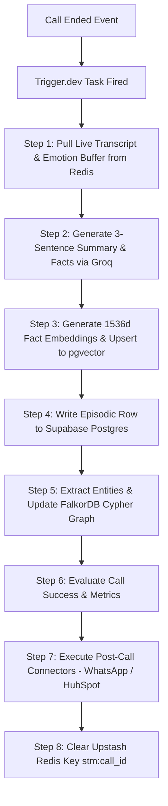

# VoCall — Technical Requirements Document (TRD)

**Document Version:** 2.0  
**Status:** Engineering Baseline  
**Date:** July 2026  
**Author:** Lead AI Systems Architect  
**Target Platform:** VoCall Voice AI Platform Engine  

---

## 1. System Overview & Technology Stack

VoCall's technical architecture is engineered to resolve three primary challenges in voice AI: **high latency**, **contextual amnesia**, and **emotional blindness**. The system utilizes a hybrid serverless + real-time WebSocket/WebRTC microservices architecture.

```
┌─────────────────────────────────────────────────────────────────────────────────────────────┐
│                                 VOCALL TECHNOLOGY STACK                                      │
├───────────────────┬─────────────────────────────────────────────────────────────────────────┤
│ **Frontend App**  │ Next.js 14 (App Router), React 18, TypeScript, Tailwind CSS v4, Lucide  │
│ **Landing Page**  │ React 18, Vite, Tailwind CSS v4                                         │
│ **Backend API**   │ Python 3.10+, FastAPI, Uvicorn, Pydantic v2, Asyncio                   │
│ **Media Engine**  │ Pipecat AI Framework, LiveKit Cloud WebRTC Server                       │
│ **LLM Engine**    │ Groq LPU (llama-3.3-70b-versatile), Cerebras AI (Fallback)             │
│ **STT Engine**    │ Groq Whisper Large-v3 (English), Sarvam AI Saarika v2 (Hindi/Hinglish)  │
│ **TTS Engine**    │ Cartesia Sonic-2 (English), Sarvam Bulbul v2 (Hinglish), Hume Octave 2 │
│ **Emotion Engine**│ Hume AI EVI / Expression API (Audio) + Groq NLP JSON (Text)             │
│ **Databases**     │ Supabase Postgres + pgvector, Upstash Redis, FalkorDB Graph             │
│ **Background**    │ Trigger.dev Engine                                                      │
│ **Telephony**     │ Twilio, Exotel, Plivo (BYOK)                                            │
└───────────────────┴─────────────────────────────────────────────────────────────────────────┘
```

---

## 2. End-to-End Pipeline Latency Budget

```mermaid
gantt
    title Sub-500ms Real-Time Voice Turn Execution Budget
    dateFormat  X
    axisFormat %s ms

    section Caller Audio
    STT Audio Chunking & Ingestion       :active, 0, 40
    STT Inference (Groq Whisper / Sarvam) :crit, 40, 190

    section Emotion & Context
    Parallel Audio/Text Emotion Fusion   : 190, 220
    Parallel 4-Tier Memory RAG Lookups   : 190, 240

    section LLM Generation
    First-Token Generation (Groq LPU)    :active, 240, 390

    section Synthesis & Output
    TTS Audio Synthesis (Cartesia / Hume):crit, 390, 470
    WebRTC Packet Transmission           : 470, 495
```



- **Total Budget:** $\le 495\text{ ms}$
- **STT (Groq Whisper):** $\sim 150\text{ ms}$
- **Emotion & Context Fanout:** $\sim 30\text{ ms}$ (executed concurrently)
- **LLM TTFT (Groq LLaMA 3.3 70B):** $\sim 150\text{ ms}$
- **TTS TTFAB (Cartesia Sonic-2):** $\sim 80\text{ ms}$
- **Network Transport (WebRTC SRTP):** $\sim 25\text{ ms}$

---

## 3. Real-Time Streaming Architecture (Pipecat + LiveKit)

### 3.1 WebRTC Session Lifecycle (`/webcall`)

```
1. Browser Client opens WebCallModal ("Ananya UI")
2. POST /api/webcall/token { agent_id, contact_name }
   ├── FastAPI validates agent & contact (creates contact row if new)
   ├── Issue LiveKit WebRTC AccessToken with room permissions
   └── Returns { token, room_name, call_id }
3. Client connects to LiveKit Cloud Room (wss://livekit.cloud)
4. FastAPI spawns Pipecat Pipeline Instance:
   ├── Attach AudioFrameSubscriber to LiveKit AudioTrack
   ├── Initialize Redis STM key stm:{call_id}
   ├── Perform parallel 4-tier memory retrieval (`retrieve_all_memory`)
   ├── Inject context into system prompt
   └── Pipeline Loop: AudioIn -> STT -> Emotion -> LLM -> TTS -> AudioOut
```

### 3.2 Inbound Telephony Session Lifecycle (`/webhooks/twilio`)

```
1. Caller dials Twilio PSTN Phone Number
2. Twilio sends HTTP POST to FastAPI `/webhooks/twilio/inbound`
3. FastAPI looks up agent by `phone_number` and contact by `caller_id`
4. FastAPI returns TwiML Response:
   <Response>
     <Connect>
       <Stream url="wss://backend.vocall.ai/ws/twilio/{call_id}" />
     </Connect>
   </Response>
5. Twilio opens bidirectional WebSocket stream (8kHz mulaw audio)
6. FastAPI transcodes audio to 16kHz PCM and feeds into Pipecat pipeline loop
```

---

## 4. Dual-Signal Emotion Fusion Algorithm & Technical Spec

### 4.1 Input Signals
1. **Audio Signal ($E_{audio}$):** Extracted per caller turn from Hume AI Expression Measurement API ($Valence_a \in [-1, 1]$, $Arousal_a \in [0, 1]$, $Dominant_a$, $Confidence_a$).
2. **Text Signal ($E_{text}$):** Extracted per caller turn from transcript via Groq `llama-3.3-70b` in JSON mode ($Valence_t \in [-1, 1]$, $Arousal_t \in [0, 1]$, $Dominant_t$, $Confidence_t$).

### 4.2 Mathematical Fusion Model

$$Valence_{fused} = \begin{cases} 
0.6 \cdot Valence_a + 0.4 \cdot Valence_t & \text{if } Confidence_a \ge 0.50 \\
Valence_t & \text{if Audio unavailable or } Confidence_a < 0.50 
\end{cases}$$

$$Dominant_{fused} = \begin{cases}
Dominant_a & \text{if } Confidence_a \ge 0.60 \\
Dominant_t & \text{otherwise}
\end{cases}$$

### 4.3 Runtime Adaptation Handlers
- **Empathetic System Prompt Injection:** If $Valence_{fused} < -0.40$, prepend to current turn LLM system prompt:
  ```text
  [EMOTION ALERT: Caller valence is negative (-0.48, Frustrated). Soften your tone, slow down your pace, validate their feeling first, and keep responses under 2 sentences.]
  ```
- **Hume Octave TTS Voice Modulation:** Pass `emotion_state` payload to Hume Octave API:
  ```json
  {
    "voice_id": "octave_empathic_01",
    "emotion_params": {
      "warmth": 0.85,
      "pace_multiplier": 0.90,
      "pitch_softness": 0.75
    }
  }
  ```

---

## 5. 4-Tier Memory Technical Specification

```
┌─────────────────────────────────────────────────────────────────────────────────────────────────┐
│                                   4-TIER MEMORY STORAGE ENGINE                                  │
├─────────────────┬─────────────────┬───────────────────┬─────────────────────────────────────────┤
│ Tier            │ Engine          │ Data Structure    │ Persistence & Key TTL                   │
├─────────────────┼─────────────────┼───────────────────┼─────────────────────────────────────────┤
│ 1. Short-Term   │ Upstash Redis   │ JSON Array        │ Ephemeral: Call Duration + 300s TTL     │
│ 2. Long-Term    │ Supabase        │ pgvector (1536d)  │ Permanent (Cosine similarity top-5)     │
│ 3. Episodic     │ Supabase        │ Postgres Relational│ Permanent (Chronological last 3 summaries)│
│ 4. Knowledge    │ FalkorDB        │ Cypher Graph      │ Permanent (Entity relationship graph)   │
└─────────────────┴─────────────────┴───────────────────┴─────────────────────────────────────────┘
```

### 5.1 Parallel RAG Retrieval Engine (`retrieve_all_memory`)

FastAPI uses `asyncio.gather` to execute memory fanout across all four engines in parallel:

```python
async def retrieve_all_memory(contact_id: str, current_query: str) -> Dict[str, Any]:
    redis_task = fetch_short_term_buffer(contact_id)
    vector_task = query_long_term_facts(contact_id, current_query, limit=5)
    episodic_task = fetch_last_episodes(contact_id, limit=3)
    graph_task = query_falkordb_graph(contact_id)
    
    stm, ltm, episodes, graph = await asyncio.gather(
        redis_task, vector_task, episodic_task, graph_task
    )
    return format_memory_prompt_block(stm, ltm, episodes, graph)
```

---

## 6. Database Schemas & Cypher Graph Model

### 6.1 PostgreSQL DDL (Supabase)

```sql
-- Enable Vector Extension
CREATE EXTENSION IF NOT EXISTS vector;

-- Organizations & Agents
CREATE TABLE organizations (
    id UUID PRIMARY KEY DEFAULT gen_random_uuid(),
    name TEXT NOT NULL,
    created_at TIMESTAMPTZ DEFAULT NOW()
);

CREATE TABLE agents (
    id UUID PRIMARY KEY DEFAULT gen_random_uuid(),
    org_id UUID REFERENCES organizations(id) ON DELETE CASCADE,
    name TEXT NOT NULL,
    system_prompt TEXT NOT NULL,
    language TEXT DEFAULT 'en',
    voice_provider TEXT DEFAULT 'cartesia',
    voice_id TEXT NOT NULL,
    config JSONB DEFAULT '{}'::jsonb,
    created_at TIMESTAMPTZ DEFAULT NOW()
);

-- Contacts & Calls
CREATE TABLE contacts (
    id UUID PRIMARY KEY DEFAULT gen_random_uuid(),
    org_id UUID REFERENCES organizations(id) ON DELETE CASCADE,
    name TEXT NOT NULL,
    phone_number TEXT,
    email TEXT,
    created_at TIMESTAMPTZ DEFAULT NOW()
);

CREATE TABLE calls (
    id UUID PRIMARY KEY DEFAULT gen_random_uuid(),
    agent_id UUID REFERENCES agents(id),
    contact_id UUID REFERENCES contacts(id),
    status TEXT NOT NULL CHECK (status IN ('initiated', 'in_progress', 'completed', 'failed')),
    duration_seconds INT DEFAULT 0,
    emotion_score FLOAT,
    transcript JSONB DEFAULT '[]'::jsonb,
    analysis JSONB DEFAULT '{}'::jsonb,
    created_at TIMESTAMPTZ DEFAULT NOW()
);

-- Tier 2: Long-Term Memory (pgvector)
CREATE TABLE memory_long_term (
    id UUID PRIMARY KEY DEFAULT gen_random_uuid(),
    contact_id UUID REFERENCES contacts(id) ON DELETE CASCADE,
    fact TEXT NOT NULL,
    embedding VECTOR(1536),
    emotion_state JSONB,
    created_at TIMESTAMPTZ DEFAULT NOW()
);

CREATE INDEX idx_long_term_vec ON memory_long_term USING ivfflat (embedding vector_cosine_ops);

-- Tier 3: Episodic Memory
CREATE TABLE memory_episodic (
    id UUID PRIMARY KEY DEFAULT gen_random_uuid(),
    contact_id UUID REFERENCES contacts(id) ON DELETE CASCADE,
    call_id UUID REFERENCES calls(id) ON DELETE CASCADE,
    summary TEXT NOT NULL,
    key_facts JSONB DEFAULT '[]'::jsonb,
    emotion_arc JSONB DEFAULT '[]'::jsonb,
    created_at TIMESTAMPTZ DEFAULT NOW()
);
```

### 6.2 FalkorDB Cypher Knowledge Graph Model

```cypher
// Node Schema
(:Contact {id: "cnt_123", name: "Priyanshu"})
(:Entity {name: "Billing Issue", category: "Topic"})
(:Episode {call_id: "call_456", date: "2026-07-22"})
(:Emotion {type: "Frustration", score: 0.82})

// Relationships
(:Contact)-[:MENTIONED]->(:Entity)
(:Contact)-[:FRUSTRATED_ABOUT {severity: 0.82}]->(:Entity)
(:Episode)-[:OCCURRED_IN]->(:Contact)
(:Entity)-[:LEADS_TO]->(:Entity)

// RAG Retrieval Query
MATCH (c:Contact {id: $contact_id})-[r:FRUSTRATED_ABOUT]->(e:Entity)
RETURN e.name AS topic, r.severity AS score
ORDER BY r.severity DESC LIMIT 5
```

---

## 7. Async Post-Call Pipeline (Trigger.dev)

When a call completes (`POST /webhooks/twilio/status` or `WebCallModal` end event), FastAPI dispatches the `postCallPipeline` job to Trigger.dev:



---

## 8. Data Security & DPDP Compliance Suite

1. **BYOK Encryption:** API Keys (Groq, Hume, Cartesia, Twilio) encrypted using AES-256-GCM prior to storage in `connector_configs`.
2. **Tenant Isolation:** Every database table strictly governed by Supabase Row-Level Security (RLS) policies enforcing `auth.uid() -> org_id` scoping.
3. **DPDP "Forget Me" Cascade Engine:**  
   Invoking `DELETE /api/contacts/{id}/memory` triggers an atomic transaction across all storage tiers:
   - `DEL stm:contact_{id}:*` in Upstash Redis.
   - `DELETE FROM memory_long_term WHERE contact_id = id` in pgvector.
   - `DELETE FROM memory_episodic WHERE contact_id = id` in Postgres.
   - `MATCH (c:Contact {id: id}) DETACH DELETE c` in FalkorDB.

---
*Approved by VoCall Core Engineering Team*
