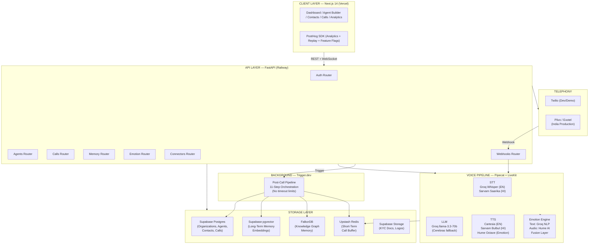
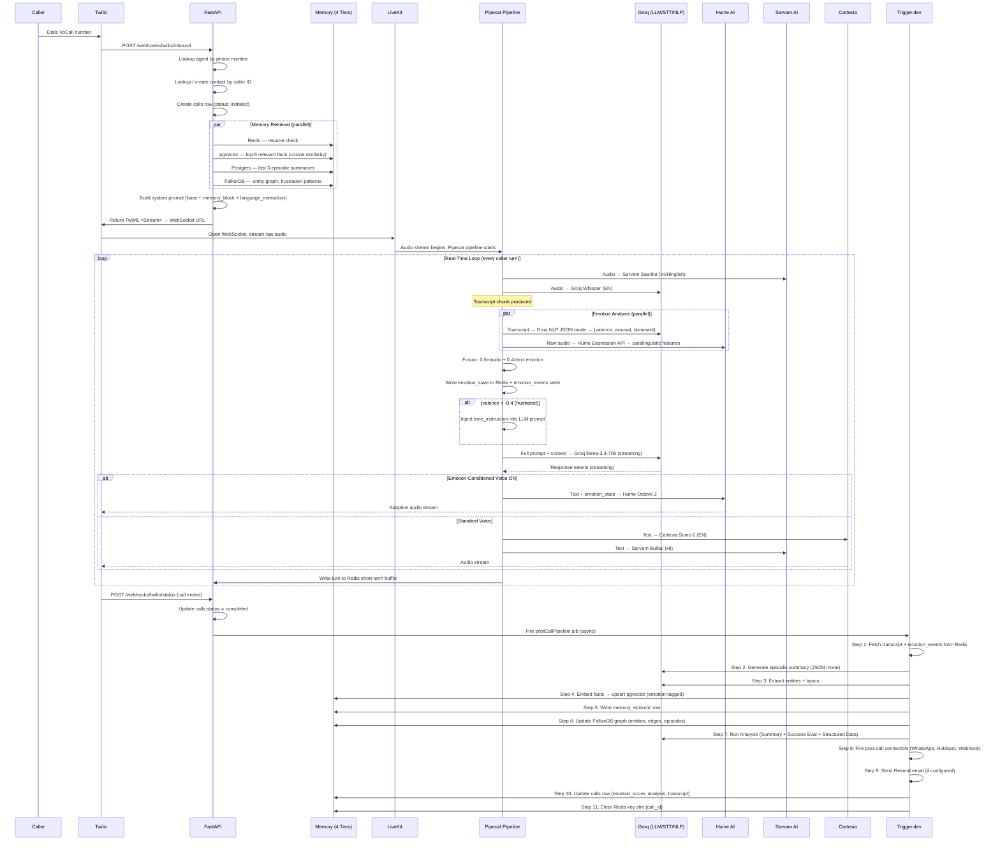
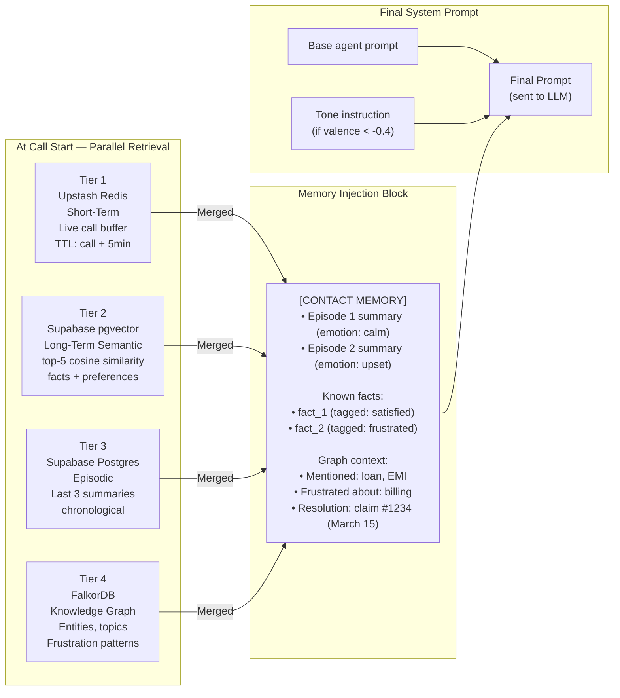
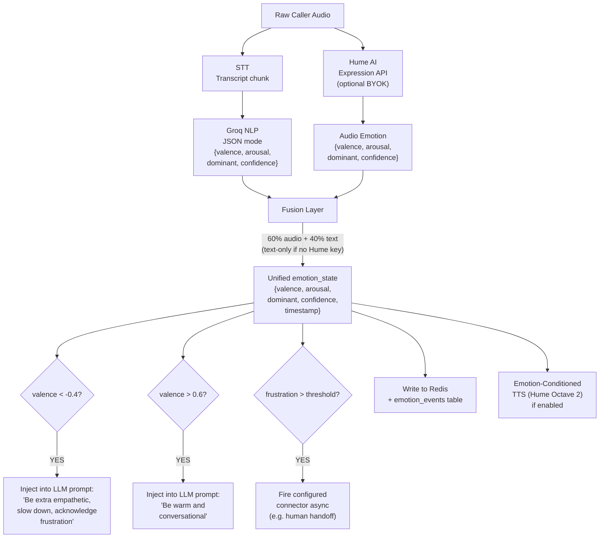
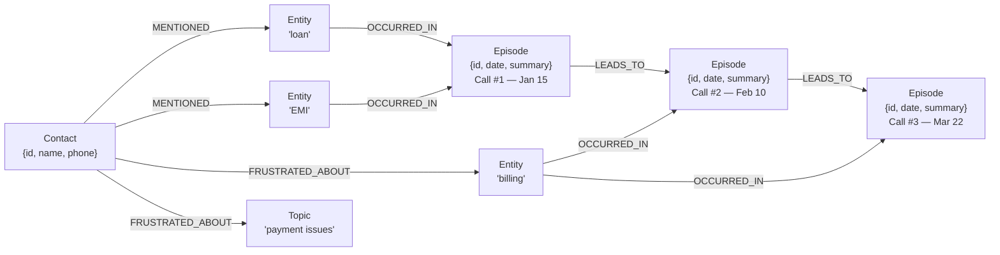
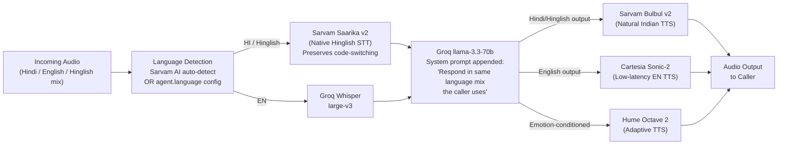
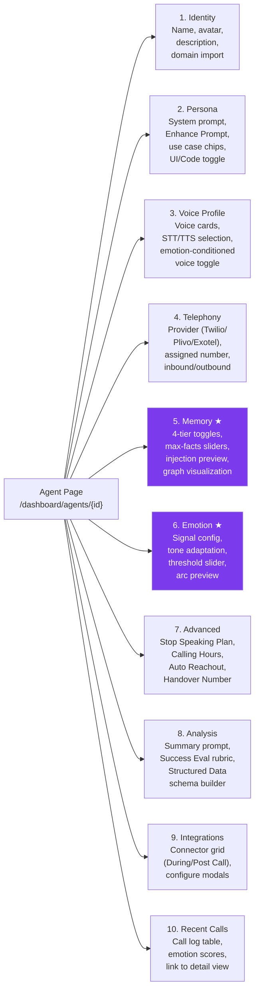

# VoCall — Research Paper: Diagrams, Tables & Supporting Material

---

## 1. System Architecture Overview

---

## 2. Inbound Call — Full End-to-End Sequence

---

## 3. 4-Tier Memory Architecture

---

## 4. Emotion System Pipeline

---

## 5. Knowledge Graph Memory — Node/Edge Schema

---

## 6. Hinglish Language Pipeline

---

## 7. Post-Call Pipeline — Trigger.dev Job Flow

```mermaid
flowchart TD
    START["Call Ended\nTwilio status webhook"] --> FIRE["Trigger.dev\npostCallPipeline job"]
    
    FIRE --> S1["Step 1\nFetch transcript +\nemotion_events from Redis"]
    S1 --> S2["Step 2\nGroq → Episodic summary\n(JSON mode, 2-3 sentences)"]
    S2 --> S3["Step 3\nGroq → Extract entities\n+ topics (JSON mode)"]
    S3 --> S4["Step 4\nEmbed facts → upsert pgvector\n(emotion-tagged writes)"]
    S4 --> S5["Step 5\nWrite memory_episodic row\n(Postgres)"]
    S5 --> S6["Step 6\nUpdate FalkorDB graph\n(Entity nodes, Episode node,\nFRUSTRATED_ABOUT edges,\nLEADS_TO chains)"]
    S6 --> S7["Step 7\nRun Analysis\n(Summary + Success Eval +\nStructured Data via Groq)"]
    S7 --> S8["Step 8\nFire post-call connectors\n(WhatsApp / HubSpot / Webhook)\nRetry: max 3 attempts"]
    S8 --> S9["Step 9\nSend Resend email\n(if configured)"]
    S9 --> S10["Step 10\nUpdate calls row\n(emotion_score, analysis,\ntranscript)"]
    S10 --> S11["Step 11\nClear Redis key\nstm:{call_id}"]
    S11 --> DONE["Pipeline Complete\nAll steps logged to\nTrigger.dev dashboard\n+ Better Stack"]

    style S6 fill:#7C3AED,color:#fff
    style S4 fill:#7C3AED,color:#fff
    style S7 fill:#7C3AED,color:#fff
```

---

## 8. Agent Builder Tab Structure

---

## TABLE 1 — Comparative Analysis of Existing Voice Agent Platforms

| Feature | **VoCall** | **Vapi** | **Retell AI** | **OmniDim** | **Unpod** |
|---|---|---|---|---|---|
| **Persistent memory across calls** | ✅ 4-tier (Redis + pgvector + Postgres + FalkorDB) | ❌ No memory | ❌ No memory | ❌ No memory | ⚠️ Toggle only (no depth) |
| **Short-term call memory** | ✅ Upstash Redis, TTL-based | ❌ | ❌ | ❌ | ❌ |
| **Long-term semantic memory** | ✅ pgvector cosine similarity | ❌ | ❌ | ❌ | ❌ |
| **Episodic memory (post-call summaries)** | ✅ Groq-generated, Postgres stored | ❌ | ❌ | ❌ | ❌ |
| **Knowledge graph memory** | ✅ FalkorDB (entities, edges, Cypher) | ❌ | ❌ | ❌ | ❌ |
| **Real-time text emotion detection** | ✅ Groq NLP, every turn | ❌ | ❌ | ⚠️ Post-call only | ❌ |
| **Real-time audio emotion detection** | ✅ Hume AI Expression API | ❌ | ❌ | ❌ | ❌ |
| **Dual-signal emotion fusion** | ✅ 60% audio + 40% text | ❌ | ❌ | ❌ | ❌ |
| **Tone adaptation (prompt injection)** | ✅ Per-turn, threshold-based | ❌ | ❌ | ❌ | ❌ |
| **Emotion-conditioned voice generation** | ✅ Hume Octave 2 | ❌ | ❌ | ❌ | ❌ |
| **Emotion-tagged memory writes** | ✅ Every write carries emotion_state | ❌ | ❌ | ❌ | ❌ |
| **Hinglish STT** | ✅ Sarvam Saarika v2 | ❌ | ❌ | ❌ | ❌ |
| **Indian language TTS** | ✅ Sarvam Bulbul v2 | ❌ | ❌ | ❌ | ❌ |
| **India telephony (Plivo/Exotel)** | ✅ BYOK | ⚠️ Twilio only | ⚠️ Twilio only | ❌ | ✅ |
| **KYC compliance (TRAI)** | ✅ Document upload + status tracking | ❌ | ❌ | ❌ | ✅ |
| **DPDP Act 2023 forget-me** | ✅ Cross-tier cascade delete | ❌ | ❌ | ❌ | ❌ |
| **Open-source + self-hostable** | ✅ MIT | ❌ Closed | ❌ Closed | ❌ Closed | ✅ MIT |
| **BYOK (Bring Your Own Key)** | ✅ 9 providers | ❌ | ❌ | ❌ | ❌ |
| **INR pricing** | ✅ | ❌ USD only | ❌ USD only | ❌ USD only | ✅ |
| **Post-call structured data extraction** | ✅ Groq JSON mode + custom schema | ✅ | ✅ | ⚠️ Limited | ✅ |
| **Success evaluation rubric** | ✅ Configurable rubric | ✅ | ✅ | ⚠️ | ✅ |
| **During-call connectors (function calling)** | ✅ Google Cal, HubSpot, Webhook, Supabase | ✅ | ✅ | ⚠️ | ✅ |
| **Emotion arc visualization** | ✅ Per-call Recharts chart | ❌ | ❌ | ⚠️ Post-call | ❌ |
| **Frustration threshold auto-trigger** | ✅ Configurable slider → connector | ❌ | ❌ | ❌ | ❌ |
| **Background job orchestration** | ✅ Trigger.dev (no timeout) | Managed | Managed | Managed | ❌ |

**Legend:** ✅ = Full support | ⚠️ = Partial / limited | ❌ = Not supported

---

## TABLE 2 — STT Provider Comparison (for Research Paper)

| Provider | Model | Language Support | Latency | Hinglish Accuracy | Pricing | Selected For |
|---|---|---|---|---|---|---|
| **Groq Whisper** | Whisper large-v3 | 57 languages (EN primary) | ~150ms | Poor (forces one language) | Free tier | VoCall EN STT |
| **Sarvam AI Saarika** | Saarika v2 | Hindi, Hinglish, 10 Indian languages | ~200ms | Excellent (natively trained) | Free developer tier | VoCall HI/Hinglish STT |
| OpenAI Whisper (API) | Whisper large-v3 | 57 languages | ~800ms | Poor | Paid ($0.006/min) | Rejected (latency) |
| AssemblyAI | Universal-2 | EN + limited others | ~250ms | No support | Paid | Rejected (no Hinglish) |
| Deepgram Nova-2 | Nova-2 | EN + 36 languages | ~120ms | No support | Paid | Rejected (no Hindi) |
| Azure Speech | Neural | 100+ languages | ~300ms | Limited, robotic | Paid | Rejected (quality) |
| AWS Transcribe | — | 100+ languages | ~400ms | Limited | Paid | Rejected (latency + cost) |

---

## TABLE 3 — TTS Provider Comparison (for Research Paper)

| Provider | Model | Language | TTFAB | Hinglish | Emotion-Conditioned | Pricing | Selected For |
|---|---|---|---|---|---|---|---|
| **Cartesia** | Sonic-2 | EN | ~80ms | ❌ | ❌ | Free tier | VoCall EN TTS |
| **Sarvam AI** | Bulbul v2 | HI/Hinglish/10 Indian | ~150ms | ✅ Natural | ❌ | Free developer tier | VoCall HI TTS |
| **Hume AI** | Octave 2 | EN | ~75ms | ❌ | ✅ (unique) | Free: 10K chars/mo | VoCall Emotion TTS |
| ElevenLabs | v2.5 | EN + 32 languages | ~400ms | ❌ | ❌ | Paid ($0.18/1K chars) | Rejected (latency+cost) |
| OpenAI TTS | TTS-1-HD | EN + limited | ~500ms | ❌ | ❌ | Paid ($15/1M chars) | Rejected (slow) |
| Google TTS | WaveNet | 50+ languages | ~300ms | ⚠️ Robotic | ❌ | Paid | Rejected (quality) |
| Azure TTS | Neural | 140 languages | ~250ms | ⚠️ Robotic | ❌ | Paid | Rejected (quality) |

---

## TABLE 4 — LLM Provider Comparison (for Research Paper)

| Provider | Model | Context Window | First-Token Latency | Free Tier | Hinglish | Fallback Role |
|---|---|---|---|---|---|---|
| **Groq** | llama-3.3-70b-versatile | 128K tokens | ~400ms | ✅ (generous RPM) | ✅ Native | Primary LLM |
| **Cerebras** | llama-3.3-70b | 128K tokens | ~200ms | ✅ 1M tokens/day | ✅ Native | Fallback (on 429) |
| OpenAI | GPT-4o | 128K tokens | ~800ms | ❌ Paid | ✅ | Rejected (cost) |
| Anthropic | Claude 3.5 Sonnet | 200K tokens | ~600ms | ❌ Paid | ✅ | Rejected (cost) |
| Google | Gemini 1.5 Flash | 1M tokens | ~500ms | ⚠️ Limited | ✅ | Considered for v2 |
| Together AI | Various | Varies | ~350ms | ⚠️ | ✅ | Considered for v2 |

---

## TABLE 5 — Memory System Comparison: VoCall vs Existing Work

| Dimension | **VoCall (Proposed)** | **Mem0** | **Zep** | **MemGPT** | **Vapi/Retell (baseline)** |
|---|---|---|---|---|---|
| **Architecture** | 4-tier (Redis + pgvector + Postgres + FalkorDB) | Unified vector store | Vector + entity store | Virtual context manager | None |
| **Short-term (within call)** | ✅ Redis, TTL-based | ❌ | ❌ | ⚠️ Context window only | ❌ |
| **Long-term semantic** | ✅ pgvector, cosine similarity | ✅ | ✅ | ✅ | ❌ |
| **Episodic (per-session summaries)** | ✅ LLM-generated, structured JSON | ⚠️ Partial | ✅ | ✅ | ❌ |
| **Knowledge graph** | ✅ FalkorDB, Cypher, entity-relationship | ❌ | ⚠️ Partial | ❌ | ❌ |
| **Emotion-tagged writes** | ✅ emotion_state on every write | ❌ | ❌ | ❌ | ❌ |
| **Emotion-conditioned retrieval** | ✅ Retrieval weighted by emotional context | ❌ | ❌ | ❌ | ❌ |
| **Real-time injection** | ✅ < 200ms at call start | ✅ (async) | ✅ (async) | ⚠️ Slow | ❌ |
| **DPDP/GDPR forget-me** | ✅ Cross-tier cascade | ⚠️ Partial | ✅ | ❌ | ❌ |
| **India deployment (free tier)** | ✅ All free tiers | ❌ Paid SaaS | ❌ Paid SaaS | Self-hosted (GPU) | N/A |
| **Self-hostable** | ✅ | ❌ | ✅ | ✅ (complex) | N/A |

---

## TABLE 6 — Emotion Detection Approach Comparison

| Approach | Signal Type | Latency | Accuracy | Real-Time Capable | Used In Prior Systems |
|---|---|---|---|---|---|
| **VoCall Text NLP (Groq)** | Text transcript | ~120ms | Moderate | ✅ Per-turn | Rare in voice agents |
| **VoCall Audio (Hume AI)** | Raw audio paralinguistic | ~180ms | High | ✅ Streaming | ❌ Not in voice agent platforms |
| **VoCall Fusion (proposed)** | Text + Audio weighted | ~200ms | High | ✅ Per-turn | ❌ Novel contribution |
| Sentiment analysis (VADER/BERT) | Text only | ~50ms | Low-Moderate | ✅ | ⚠️ Some platforms |
| AWS Comprehend | Text only | ~300ms + cost | Moderate | ⚠️ Latency concern | Rare |
| Manual supervisor monitoring | Human observation | Minutes | High | ❌ Not scalable | Legacy call centers |
| Post-call audio analysis | Audio (batch) | Minutes | High | ❌ Not real-time | OmniDim (partial) |
| Keyword spotting | Text (rules) | ~10ms | Low | ✅ | ⚠️ Crude approaches |

---

## TABLE 7 — Performance Requirements vs Targets (System Design Table)

| Component | Metric | VoCall Target | Industry Baseline | Notes |
|---|---|---|---|---|
| **Full pipeline (TTFAB)** | Time to first audio byte | < 800ms | 1200–2000ms | Groq LPU advantage |
| **STT (English)** | Transcription latency | < 150ms | 300–500ms | Groq Whisper on LPU |
| **STT (Hinglish)** | Transcription latency | < 200ms | N/A (no baseline) | Novel: Sarvam Saarika |
| **LLM first token** | Time to first token | < 400ms | 600–1500ms | Groq llama-3.3-70b |
| **TTS (English)** | Audio start latency | < 80ms | 200–400ms | Cartesia Sonic-2 |
| **TTS (Hinglish)** | Audio start latency | < 150ms | N/A | Sarvam Bulbul v2 |
| **TTS (Emotion)** | Audio start latency | < 75ms | N/A | Hume Octave 2 |
| **Memory retrieval** | All 4 tiers at call start | < 200ms | N/A | Parallel fan-out |
| **Emotion NLP** | Per-turn text analysis | < 120ms | N/A | Groq JSON mode |
| **Emotion audio** | Per-turn audio analysis | < 180ms | N/A | Hume Expression API |
| **Emotion fusion** | Combined output | < 200ms | N/A | Custom logic |
| **Post-call pipeline** | Full 11-step job | < 10s | N/A | Trigger.dev async |
| **API responses** | Non-voice endpoints | < 500ms | < 1000ms | FastAPI on Railway |

---

## TABLE 8 — Research Contributions Mapping

| # | Novel Contribution | System Component | Research Claim | Evaluation Method |
|---|---|---|---|---|
| **C1** | 4-tier persistent memory for voice agents | Redis + pgvector + Postgres + FalkorDB | First voice agent platform implementing 4-tier memory hierarchy | A/B test: memory vs no-memory baseline — context relevance score, caller recall |
| **C2** | Dual-signal real-time emotion detection | Groq NLP + Hume AI + Fusion Layer | Fusion of text NLP + audio paralinguistic signals > either signal alone for real-time accuracy | Agreement rate vs ground truth labels; ablation study (text-only vs audio-only vs fused) |
| **C3** | Emotion-conditioned memory retrieval | retriever.py + emotion_state tags | Emotion context improves memory relevance for returning callers | Relevance score comparison: tagged vs untagged retrieval |
| **C4** | Hinglish-native voice agent pipeline | Sarvam Saarika + Bulbul + LLM instruction | First end-to-end voice agent platform with Hinglish code-switching STT/TTS | WER on Hinglish test set; naturalness MOS score; code-switching preservation rate |
| **C5** | Knowledge graph memory for voice agents | FalkorDB + Cypher queries | Graph-structured contact memory captures cross-session entity relationships that flat vector stores cannot | Precision/recall of entity relationship retrieval; frustration pattern detection accuracy |
| **Bonus** | Emotion-conditioned voice generation | Hume Octave 2 integration | Dynamic TTS tone adaptation based on detected caller emotion reduces call escalation rate | Caller satisfaction survey; escalation rate comparison (adaptive vs static TTS) |

---

## TABLE 9 — Open-Source Voice Agent Platform Comparison (Deployment Model)

| Platform | License | Self-Hostable | BYOK | Free Tier | India-First | Memory | Emotion |
|---|---|---|---|---|---|---|---|
| **VoCall** | MIT | ✅ Docker Compose | ✅ 9 providers | ✅ All free tiers | ✅ | ✅ 4-tier | ✅ Dual-signal |
| Unpod | MIT | ✅ | ❌ | ✅ | ⚠️ Partial | ⚠️ Toggle only | ❌ |
| Pipecat (framework) | BSD-2 | ✅ | ✅ | ✅ | ❌ | ❌ (framework only) | ❌ |
| Livekit Agents | Apache 2.0 | ✅ | ✅ | ✅ | ❌ | ❌ (framework only) | ❌ |
| Vapi | Proprietary | ❌ | ❌ | ⚠️ Trial only | ❌ | ❌ | ❌ |
| Retell AI | Proprietary | ❌ | ❌ | ⚠️ Trial only | ❌ | ❌ | ❌ |
| OmniDim | Proprietary | ❌ | ❌ | ⚠️ Trial only | ❌ | ❌ | ⚠️ Post-call only |

---

## TABLE 10 — Technology Stack Summary (for Paper Section 3: System Design)

| Layer | Component | Technology | Version | Justification |
|---|---|---|---|---|
| **Frontend** | Web app | Next.js | 14 (App Router) | SSR, file-based routing, Vercel deploy |
| **Backend** | API server | FastAPI | Latest | Async Python, Pipecat-compatible, fast |
| **Primary DB** | Relational store | Supabase Postgres | — | RLS, Realtime, free tier |
| **Vector DB** | Semantic memory | Supabase pgvector | — | Co-located, no extra service |
| **Short-term memory** | Call buffer | Upstash Redis | — | Serverless, TTL, REST API |
| **Graph memory** | Entity relationships | FalkorDB | — | Redis-compatible, Cypher, free |
| **Auth** | Identity | Supabase Auth | — | JWT, social login, free |
| **File storage** | KYC/media | Supabase Storage | — | RLS-protected buckets |
| **Primary LLM** | Conversation | Groq llama-3.3-70b-versatile | — | ~400ms first token, free tier, LPU hardware |
| **Fallback LLM** | Rate-limit fallback | Cerebras llama-3.3-70b | — | 1M tokens/day free, wafer-scale chips |
| **STT (English)** | Speech recognition | Groq Whisper large-v3 | — | ~150ms, LPU-accelerated |
| **STT (Hinglish)** | Hindi/code-switch STT | Sarvam AI Saarika v2 | — | Only natively trained Hinglish STT |
| **TTS (English)** | Voice synthesis | Cartesia Sonic-2 | — | ~80ms TTFAB, free tier |
| **TTS (Hindi)** | Voice synthesis | Sarvam AI Bulbul v2 | — | Natural Indian voices |
| **TTS (Emotion)** | Adaptive synthesis | Hume Octave 2 | — | Only emotion-conditioned TTS available |
| **Voice pipeline** | Real-time orchestration | Pipecat | Latest | Open-source, streaming stages |
| **Media server** | WebRTC | LiveKit | Cloud/self-hosted | Native Pipecat integration |
| **Audio emotion** | Paralinguistic analysis | Hume AI Expression API | — | Research-backed 27-emotion taxonomy |
| **Text emotion** | NLP sentiment | Groq llama-3.3-70b | JSON mode | Already in stack, free |
| **Telephony (dev)** | Call routing | Twilio | — | Free trial, Pipecat examples |
| **Telephony (prod)** | India calling | Plivo / Exotel | BYOK | INR billing, TRAI compliance |
| **Background jobs** | Post-call pipeline | Trigger.dev | v3 | No timeout limits, retry dashboard |
| **Email** | Transactional | Resend | — | Developer-friendly, free tier |
| **Analytics** | Product events | PostHog | — | 1M events/mo free, session replay |
| **Monitoring** | Uptime + logs | Better Stack | — | Free monitoring + status page |
| **Deployment (FE)** | Frontend hosting | Vercel | — | Next.js native, free tier |
| **Deployment (BE)** | Backend hosting | Railway | — | FastAPI + Pipecat, free tier |

---

## Figure Captions (for IEEE/ACM paper)

- **Fig. 1** — VoCall system architecture: five-layer design separating client, API, storage, voice pipeline, and background job concerns.
- **Fig. 2** — Inbound call sequence diagram: full interaction from dial-in to post-call pipeline completion.
- **Fig. 3** — 4-tier memory architecture: tier roles, retrieval methods, and unified injection template.
- **Fig. 4** — Dual-signal emotion pipeline: text NLP + audio paralinguistic fusion with downstream behavioral triggers.
- **Fig. 5** — Knowledge graph schema: FalkorDB node types and edge relationships for per-contact episodic memory.
- **Fig. 6** — Hinglish pipeline: language-conditional STT/TTS routing with LLM code-switching instruction.
- **Fig. 7** — Post-call pipeline (Trigger.dev): 11-step orchestration job with retry semantics and storage targets.

---

*Document generated for VoCall B.Tech Major Project — GNIOT, 2026–27*
*Author: Priyanshu Kumar*
