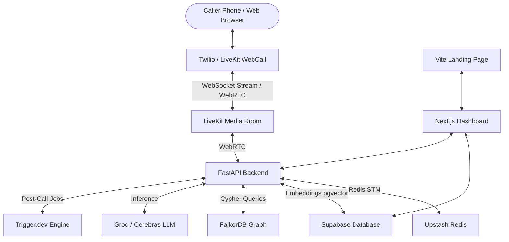

# VoCall — Open-Source Voice Agent Platform

VoCall is an enterprise-grade, open-source voice agent platform designed for building, orchestrating, and deploying low-latency real-time voice AI agents. It features a dual-signal emotion analysis engine and a unique 4-tier memory architecture to enable natural, contextual, and high-empathy voice conversations.

> [!NOTE]
> **Attribution:** The dashboard UI patterns are adapted from Unpod ([github.com/unpod-ai/unpod](https://github.com/unpod-ai/unpod)), licensed under the MIT License.

---

## Table of Contents
1. [Key Features](#key-features)
2. [Project Architecture](#project-architecture)
3. [Directory Structure](#directory-structure)
4. [Prerequisites](#prerequisites)
5. [Quickstart Setup](#quickstart-setup)
   - [1. Database (Supabase) Setup](#1-database-supabase-setup)
   - [2. Backend Development (FastAPI)](#2-backend-development-fastapi)
   - [3. Dashboard Development (Next.js)](#3-dashboard-development-nextjs)
   - [4. Landing Page Setup (Vite + React)](#4-landing-page-setup-vite--react)
   - [5. Background Jobs (Trigger.dev)](#5-background-jobs-triggerdev)
6. [Environment Variables](#environment-variables)
7. [Docker Compose Deployment](#docker-compose-deployment)
8. [License](#license)

---

## Key Features

### 🎙️ Speech & Voice AI (STT & TTS)
- **Speech-to-Text (STT):** Auto-routed based on language. Uses **Groq (Whisper-large-v3)** for low-latency English transcription (~150ms) and **Sarvam AI (Saarika v2)** for natural Hinglish code-switched understanding (~200ms).
- **Text-to-Speech (TTS):** Generates voice replies using **Cartesia (Sonic-2)** for sub-80ms English speech, **Sarvam AI (Bulbul v2)** for native Hindi/Hinglish speech, and **Hume AI (Octave 2)** for emotion-conditioned voice generation.

### 🧠 4-Tier Memory System (VoCall-Exclusive)
- **Short-Term Memory:** Live conversation transcript and emotional state buffer powered by **Upstash Redis** (cleared post-call).
- **Long-Term Memory:** Semantic facts and user preferences stored as embeddings in **Supabase pgvector** (retrieved via cosine similarity).
- **Episodic Memory:** Structured post-call summaries and historical context stored in **Supabase Postgres** (retrieves the last 3 call summaries).
- **Knowledge Graph Memory:** Entity-relationship graphs built with **FalkorDB** to track long-term relationship patterns, billing issues, and frustration paths across multiple calls.
- **DPDP Compliance:** Single-click "Forget Me" compliance that cascades deletion of all memory tiers for a contact to satisfy India's Digital Personal Data Protection Act 2023.

### 🎭 Dual-Signal Emotion Engine
- **Text Emotion Signal:** Real-time Groq Llama-3.3-70b NLP analysis on text transcripts.
- **Audio Emotion Signal:** Real-time paralinguistic tone analysis directly from caller audio via **Hume AI EVI**.
- **Emotion Fusion:** Combines audio and text cues to compute a unified valence/arousal state, triggering dynamic system prompt changes (e.g., empathetic tone shift when valence drops) and auto-routing/escalation rules.

### 📞 Telephony & Web Voice Integrations
- **Web Browser Calling:** Instant in-browser WebRTC voice agent testing via **LiveKit WebCall pipeline** and interactive modal (`WebCallModal`).
- **Twilio:** Used for rapid development, testing, and streaming raw telephony audio via WebSockets.
- **Exotel / Plivo:** Bring Your Own Key (BYOK) integrations for low-cost, TRAI-compliant telephony in India.

### ⚙️ Multi-Connector Actions & Workflows
- **During-Call Tools:** mid-call operations via LLM function calling (Google Calendar appointments, HubSpot leads, database queries, and custom webhooks).
- **Post-Call Pipeline:** Triggered asynchronously via **Trigger.dev** to generate summaries, write episodic memory, update the knowledge graph, and send WhatsApp/Email alerts.

---

## Project Architecture

The repository is organized into three major components:
1. **Landing Page:** A lightweight, high-performance showcase website built with React, Vite, and Tailwind CSS v4.
2. **Dashboard Web App:** A Next.js 14 application providing full organization settings, agent configuration tabs, contact details, memory visualizations (FalkorDB graphs), in-browser Web Voice Call testing, call history, and Recharts-based analytics consoles.
3. **Backend API:** A Python FastAPI service handling WebSocket and WebRTC connections from LiveKit/Twilio, LLM completions, memory lookups, and webhook routing.



---

## Directory Structure

```text
├── app/                      # FastAPI Backend (Python)
│   ├── core/                 # Configuration & settings management
│   ├── models/               # SQLAlchemy / SQLModel schemas
│   ├── routers/              # API Route controllers (agents, calls, memory, etc.)
│   ├── services/             # STT, TTS, LLM, Redis, FalkorDB, & WebCall pipeline
│   └── main.py               # Backend application entry point
├── components/               # Frontend component sharing & TypeScript templates
├── Documentation/            # Detailed PRD, Architecture, Features, and Design docs
├── src/                      # Landing Page Frontend (Vite + React + Tailwind v4)
├── supabase/                 # Supabase configuration & migrations
├── tests/                    # Pytest backend test suite
├── trigger/                  # Trigger.dev background jobs
├── vocall/                   # Alternative monorepo configuration (Next.js frontend + FastAPI backend)
│   ├── docs/                 # UI requirement and changes documentation
│   ├── frontend/             # Next.js 14 App Router, TypeScript, shadcn/ui Dashboard & WebCallModal
│   └── backend/              # Alternative FastAPI layout
├── docker-compose.yml        # Multi-container local deployment orchestration
├── package.json              # Landing page frontend package manifest
└── README.md                 # Project main documentation
```

---

## Prerequisites

Ensure you have the following installed on your machine:
- **Node.js:** v18.x or later (v20+ recommended)
- **Python:** v3.10 or later
- **Supabase CLI:** (For database local development or managing migrations)
- **Docker & Docker Compose:** (Optional, for FalkorDB and containerized runs)

---

## Quickstart Setup

### 1. Database (Supabase) Setup
If you are developing locally or using Supabase Cloud:
1. Initialize a Supabase project.
2. Link your project and apply the migrations:
   ```bash
   supabase link --project-ref your-project-ref
   supabase db push
   ```
   *This applies the `20260722_connector_configs.sql` migration and configures the `connector_configs` tables and row-level security (RLS).*

### 2. Backend Development (FastAPI)
1. Navigate to the backend folder and create a virtual environment:
   ```bash
   # From root directory:
   python -m venv venv
   source venv/bin/activate  # On Windows: .\venv\Scripts\activate
   ```
2. Install Python dependencies:
   ```bash
   pip install -r app/requirements.txt
   ```
3. Copy environment configurations and update with your API keys:
   ```bash
   cp vocall/.env.example .env
   ```
4. Start the development backend:
   ```bash
   uvicorn app.main:app --reload --port 8000
   ```
   API Documentation is available locally at [http://localhost:8000/docs](http://localhost:8000/docs).

5. (Optional) Run tests:
   ```bash
   pytest tests/
   ```

### 3. Dashboard Development (Next.js)
The core user console and agent builder live inside `vocall/frontend`.
1. Navigate to the frontend folder:
   ```bash
   cd vocall/frontend
   ```
2. Install npm dependencies:
   ```bash
   npm install
   ```
3. Set up frontend environment parameters (you can symlink or copy `.env` from the root):
   ```bash
   cp ../.env.example .env.local
   ```
4. Start the Next.js development server:
   ```bash
   npm run dev
   ```
   The dashboard runs at [http://localhost:3000](http://localhost:3000).

### 4. Landing Page Setup (Vite + React)
To run the public-facing landing page:
1. Return to the project root directory.
2. Install npm dependencies:
   ```bash
   npm install
   ```
3. Start the Vite server:
   ```bash
   npm run dev
   ```
   The landing page is accessible at [http://localhost:5173](http://localhost:5173).

### 5. Background Jobs (Trigger.dev)
Background tasks (like post-call evaluations and FalkorDB graph updates) are managed via Trigger.dev:
1. Install the Trigger CLI:
   ```bash
   npx trigger.dev@latest init
   ```
2. Run the local dev execution bridge:
   ```bash
   npx trigger.dev@latest dev
   ```

---

## Environment Variables

Ensure the following variables are configured in your `.env` files:

| Key | Description | Required |
|---|---|---|
| `NEXT_PUBLIC_SUPABASE_URL` | Supabase Cloud API endpoint URL | Yes |
| `NEXT_PUBLIC_SUPABASE_ANON_KEY`| Public Anonymous Key for auth operations | Yes |
| `SUPABASE_SERVICE_ROLE_KEY` | Admin Key for background db operations | Yes |
| `GROQ_API_KEY` | Groq developer API key (Llama-3.3-70b-versatile) | Yes |
| `CEREBRAS_API_KEY` | Cerebras key used as LLM fallback | No |
| `UPSTASH_REDIS_REST_URL` | Redis URL for Live Session Short-Term Memory | Yes |
| `UPSTASH_REDIS_REST_TOKEN` | Redis authorization token | Yes |
| `FALKORDB_HOST` | Host address of FalkorDB server | Yes |
| `LIVEKIT_URL` | LiveKit media server WebRTC connection URL | Yes |
| `TWILIO_ACCOUNT_SID` | Twilio SID used for dialing and audio streams | Yes |
| `SARVAM_API_KEY` | Sarvam AI key (Hindi STT/TTS) | No |
| `CARTESIA_API_KEY` | Cartesia key (sonic-2 English TTS generation) | No |
| `HUME_API_KEY` | Hume AI key (Audio Emotion & Emotional Octave TTS)| No |
| `TRIGGER_SECRET_KEY` | Trigger.dev project API secret | Yes |

---

## Docker Compose Deployment

To spin up the entire stack locally—including **FalkorDB** graph engine, Redis, the backend, and both frontends—run:

```bash
docker-compose up -d --build
```

---

## License

This project is licensed under the MIT License. See individual files for licensing details.
