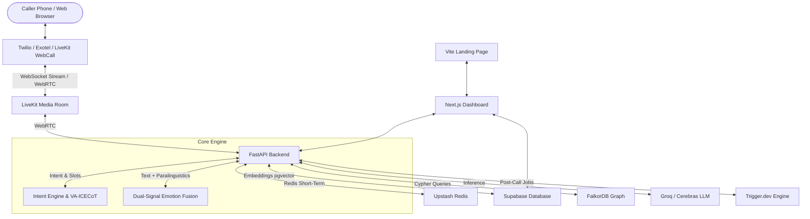

# VoCall — Open-Source Voice Agent Platform

VoCall is an enterprise-grade, open-source voice agent platform designed for building, orchestrating, and deploying low-latency real-time voice AI agents. It features a **VA-ICECoT Intent Engine**, a **Dual-Signal Emotion Analysis Engine**, and a unique **4-Tier Hybrid Memory Architecture** to enable natural, contextual, dynamic, and high-empathy voice conversations.

---

## Table of Contents
1. [Key Features](#key-features)
   - [🎯 Intent Engine & VA-ICECoT](#-intent-engine--va-icecot)
   - [🎙️ Speech & Voice AI (STT & TTS)](#-speech--voice-ai-stt--tts)
   - [🎭 Dual-Signal Emotion Engine](#-dual-signal-emotion-engine)
   - [🧠 4-Tier Hybrid Memory System](#-4-tier-hybrid-memory-system)
   - [🛠️ Agent Studio & AI Prompt Enhancer](#️-agent-studio--ai-prompt-enhancer)
   - [📞 Telephony & Web Voice Integrations](#-telephony--web-voice-integrations)
   - [⚙️ Multi-Connector Actions & Workflows](#️-multi-connector-actions--workflows)
2. [Project Architecture](#project-architecture)
3. [Directory Structure](#directory-structure)
4. [Prerequisites](#prerequisites)
5. [Quickstart Setup](#quickstart-setup)
   - [1. Database (Supabase) Setup](#1-database-supabase-setup)
   - [2. Backend Development (FastAPI)](#2-backend-development-fastapi)
   - [3. Dashboard Development (Next.js)](#3-dashboard-development-nextjs)
   - [4. Landing Page Setup (Vite + React)](#4-landing-page-setup-vite--react)
   - [5. Background Jobs (Trigger.dev)](#5-background-jobs-triggerdev)
6. [Environment Variables](#environment-variables)
7. [Docker Compose Deployment](#docker-compose-deployment)
8. [License](#license)

---

## Key Features

### 🎯 Intent Engine & VA-ICECoT
*Voice-Agent Intent, Slot & Emotion Chain-of-Thought*
- **Real-Time Intent Classification:** Powered by zero-shot LLM intent detection (`detector.py`), classifying caller goals (e.g., `book_appointment`, `file_complaint`, `request_refund`, `billing_inquiry`) with live confidence scoring.
- **Dynamic Slot Extraction & Validation:** Tracks required vs. optional slot parameters during dialogue turns (`slot_manager.py`). Prompts callers naturally for missing details before executing actions.
- **Automated Connector Chains:** Once all required slots are 100% resolved (`resolver.py`), VoCall automatically executes bound connectors (e.g., Google Calendar appointment creation, HubSpot lead updates, or custom HTTP webhooks).
- **Emotion × Intent Matrix Rules:** Multi-dimensional rule engine (`combined_rules.py`) that evaluates caller emotional state alongside intent. *Example: IF Intent == "cancel_subscription" AND Emotion == "frustrated" THEN execute "escalate_to_supervisor" with a priority transfer tag.*
- **Call Compliance & Guardrails:** Integrated compliance engine (`va_icecot.py`) enforcing mandatory disclaimers, call recording disclosures, and transaction safety checks before executing sensitive backend operations.

### 🎙️ Speech & Voice AI (STT & TTS)
- **Speech-to-Text (STT):** Auto-routed based on language. Uses **Groq (Whisper-large-v3)** for low-latency English transcription (~150ms) and **Sarvam AI (Saarika v2)** for natural Hinglish code-switched understanding (~200ms).
- **Text-to-Speech (TTS):** Generates voice replies using **Cartesia (Sonic-2)** for sub-80ms English speech, **Sarvam AI (Bulbul v2)** for native Hindi/Hinglish speech, and **Hume AI (Octave 2)** for emotion-conditioned voice generation.

### 🎭 Dual-Signal Emotion Engine
- **Text Emotion Signal:** Real-time Groq Llama-3.3-70b NLP analysis on text transcripts per turn.
- **Audio Emotion Signal:** Real-time paralinguistic tone analysis (pitch, cadence, stress) directly from caller audio via **Hume AI EVI**.
- **Emotion Fusion Engine:** Combines audio and text cues to compute a unified valence/arousal score ($Valence_{fused} = 0.6 \cdot Audio + 0.4 \cdot Text$).
- **Adaptive Voice & Prompt Shifts:** Dynamically injects tone-softening instructions into system prompts when valence drops, and modulates Hume Octave TTS voice pitch and speed in real-time.

### 🧠 4-Tier Hybrid Memory System
```text
┌─────────────────────────────────────────────────────────────────────────────────────────┐
│                                4-TIER HYBRID MEMORY MATRIX                              │
├─────────────────┬───────────────────┬───────────────────┬───────────────────────────────┤
│ Tier            │ Storage Engine    │ Scope             │ Primary Function              │
├─────────────────┼───────────────────┼───────────────────┼───────────────────────────────┤
│ 1. Short-Term   │ Upstash Redis     │ Active Call       │ Live transcript & turn buffer │
│ 2. Long-Term    │ Supabase pgvector │ Contact Semantic  │ Top-5 vector fact retrieval   │
│ 3. Episodic     │ Supabase Postgres │ Contact History   │ Last 3 post-call summaries    │
│ 4. Knowledge    │ FalkorDB          │ Contact Relational│ Cypher entity relationship    │
└─────────────────┴───────────────────┴───────────────────┴───────────────────────────────┘
```
- **DPDP Compliance ("Forget Me"):** Single API call (`DELETE /api/contacts/{id}/memory`) cascades deletion across Redis, pgvector, Postgres, and FalkorDB graph to comply with India's Digital Personal Data Protection Act 2023.

### 🛠️ Agent Studio & AI Prompt Enhancer
- **Prompt-First Builder:** Intuitive free-text system instruction editor serving as the primary configuration surface.
- **AI Prompt Enhancer:** One-click prompt optimization (`POST /api/agents/{id}/enhance-prompt`) powered by Groq Llama-3.3-70b (~400ms latency).
- **Domain Metadata Scraper:** Automatically scrape company websites (`POST /api/import-domain`) to extract brand voice, services, and core knowledge.
- **Pre-Built Templates & Dual View:** One-click use case templates (Customer Support, Sales, Booking, Healthcare, Debt Recovery) and code/visual toggle mode (`agents.config`).

### 📞 Telephony & Web Voice Integrations
- **Web Voice Studio (`WebCallModal`):** Instant in-browser WebRTC testing with live visual status orb, real-time transcript streaming, and contact linking for memory validation.
- **Twilio PSTN:** Telephony integration with raw audio WebSocket streaming.
- **BYOK Indian Telephony (Exotel / Plivo):** Low-cost, TRAI-compliant India dialing with DLT headers and document verification.

### ⚙️ Multi-Connector Actions & Workflows
- **During-Call Tools:** Mid-call execution via LLM function calling (Google Calendar, HubSpot, internal DB queries, custom HTTP webhooks).
- **Post-Call Pipeline (Trigger.dev):** Asynchronous post-call processing for transcript evaluation, episodic memory summarization, knowledge graph updates, and WhatsApp/Email dispatch.
- **Connector Configs:** Centralized credential management (`connector_configs`) for seamless multi-agent tool binding.

---

## Project Architecture


```mermaid
graph TD
    User([Caller Phone / Web Browser]) <--> Telephony[Twilio / Exotel / LiveKit WebCall]
    Telephony <-->|WebSocket Stream / WebRTC| LiveKit[LiveKit Media Room]
    LiveKit <-->|WebRTC| FastAPI[FastAPI Backend]
    
    subgraph Core Engine
        FastAPI <-->|Intent & Slots| Intent[Intent Engine & VA-ICECoT]
        FastAPI <-->|Text + Paralinguistics| Emotion[Dual-Signal Emotion Fusion]
    end

    FastAPI <-->|Redis Short-Term| Upstash[Upstash Redis]
    FastAPI <-->|Embeddings pgvector| Supabase[Supabase Database]
    FastAPI <-->|Cypher Queries| Falkor[FalkorDB Graph]
    FastAPI <-->|Inference| Groq[Groq / Cerebras LLM]
    FastAPI <-->|Post-Call Jobs| Trigger[Trigger.dev Engine]
    
    Dashboard[Next.js Dashboard] <--> Supabase
    Dashboard <--> FastAPI
    Landing[Vite Landing Page] <--> Dashboard
```

---

## Directory Structure

```text
├── app/                      # FastAPI Backend (Python)
│   ├── core/                 # Configuration & settings management
│   ├── models/               # SQLAlchemy / SQLModel schemas
│   ├── routers/              # API Route controllers (agents, calls, intent, memory, connectors)
│   ├── services/             # STT, TTS, LLM, Intent Engine, Emotion Fusion, LiveKit Service
│   └── main.py               # Backend application entry point
├── components/               # Frontend component sharing & TypeScript templates
├── Documentation/            # Detailed PRD, Architecture, Features, and Design docs
├── src/                      # Landing Page Frontend (Vite + React + Tailwind v4)
├── supabase/                 # Supabase configuration, queries, & SQL migrations
├── tests/                    # Pytest backend test suite
├── trigger/                  # Trigger.dev background jobs
├── vocall/                   # Full Monorepo Setup (Next.js dashboard + FastAPI backend)
│   ├── docs/                 # UI requirement and changes documentation
│   ├── frontend/             # Next.js 14 App Router, TypeScript, shadcn/ui Dashboard & WebCallModal
│   └── backend/              # Alternative FastAPI layout
├── docker-compose.yml        # Multi-container local deployment orchestration
├── package.json              # Landing page frontend package manifest
└── README.md                 # Main project documentation
```

---

## Prerequisites

Ensure you have the following installed on your machine:
- **Node.js:** v18.x or later (v20+ recommended)
- **Python:** v3.10 or later
- **Supabase CLI:** (For database local development or managing migrations)
- **Docker & Docker Compose:** (Optional, for FalkorDB and containerized runs)

---

## Quickstart Setup

### 1. Database (Supabase) Setup
If you are developing locally or using Supabase Cloud:
1. Initialize a Supabase project.
2. Link your project and apply the migrations:
   ```bash
   supabase link --project-ref your-project-ref
   supabase db push
   ```
   *This applies database setup scripts and configures tables, pgvector extensions, row-level security (RLS), and connector configurations.*

### 2. Backend Development (FastAPI)
1. Navigate to the root directory and activate a virtual environment:
   ```bash
   python -m venv venv
   source venv/bin/activate  # On Windows: .\venv\Scripts\activate
   ```
2. Install Python dependencies:
   ```bash
   pip install -r app/requirements.txt
   ```
3. Copy environment configurations and update with your API keys:
   ```bash
   cp vocall/.env.example .env
   ```
4. Start the development backend:
   ```bash
   uvicorn app.main:app --reload --port 8000
   ```
   API Documentation is available locally at [http://localhost:8000/docs](http://localhost:8000/docs).

5. (Optional) Run tests:
   ```bash
   pytest tests/
   ```

### 3. Dashboard Development (Next.js)
The core user console and agent builder live inside `vocall/frontend`.
1. Navigate to the frontend folder:
   ```bash
   cd vocall/frontend
   ```
2. Install npm dependencies:
   ```bash
   npm install
   ```
3. Set up frontend environment parameters:
   ```bash
   cp ../.env.example .env.local
   ```
4. Start the Next.js development server:
   ```bash
   npm run dev
   ```
   The dashboard runs at [http://localhost:3000](http://localhost:3000).

### 4. Landing Page Setup (Vite + React)
To run the public-facing landing page:
1. Return to the project root directory.
2. Install npm dependencies:
   ```bash
   npm install
   ```
3. Start the Vite server:
   ```bash
   npm run dev
   ```
   The landing page is accessible at [http://localhost:5173](http://localhost:5173).

### 5. Background Jobs (Trigger.dev)
Background tasks (like post-call evaluations and FalkorDB graph updates) are managed via Trigger.dev:
1. Install the Trigger CLI:
   ```bash
   npx trigger.dev@latest init
   ```
2. Run the local dev execution bridge:
   ```bash
   npx trigger.dev@latest dev
   ```

---

## Environment Variables

Ensure the following variables are configured in your `.env` files:

| Key | Description | Required |
|---|---|---|
| `NEXT_PUBLIC_SUPABASE_URL` | Supabase Cloud API endpoint URL | Yes |
| `NEXT_PUBLIC_SUPABASE_ANON_KEY`| Public Anonymous Key for auth operations | Yes |
| `SUPABASE_SERVICE_ROLE_KEY` | Admin Key for background db operations | Yes |
| `GROQ_API_KEY` | Groq developer API key (Llama-3.3-70b-versatile) | Yes |
| `CEREBRAS_API_KEY` | Cerebras key used as LLM fallback | No |
| `UPSTASH_REDIS_REST_URL` | Redis URL for Live Session Short-Term Memory | Yes |
| `UPSTASH_REDIS_REST_TOKEN` | Redis authorization token | Yes |
| `FALKORDB_HOST` | Host address of FalkorDB server | Yes |
| `LIVEKIT_URL` | LiveKit media server WebRTC connection URL | Yes |
| `TWILIO_ACCOUNT_SID` | Twilio SID used for dialing and audio streams | Yes |
| `SARVAM_API_KEY` | Sarvam AI key (Hindi STT/TTS) | No |
| `CARTESIA_API_KEY` | Cartesia key (sonic-2 English TTS generation) | No |
| `HUME_API_KEY` | Hume AI key (Audio Emotion & Emotional Octave TTS)| No |
| `TRIGGER_SECRET_KEY` | Trigger.dev project API secret | Yes |

---

## Docker Compose Deployment

To spin up the entire stack locally—including **FalkorDB** graph engine, Redis, backend API, and Next.js frontend—run:

```bash
docker-compose up -d --build
```

---

## License

This project is licensed under the MIT License. See individual files for licensing details.
