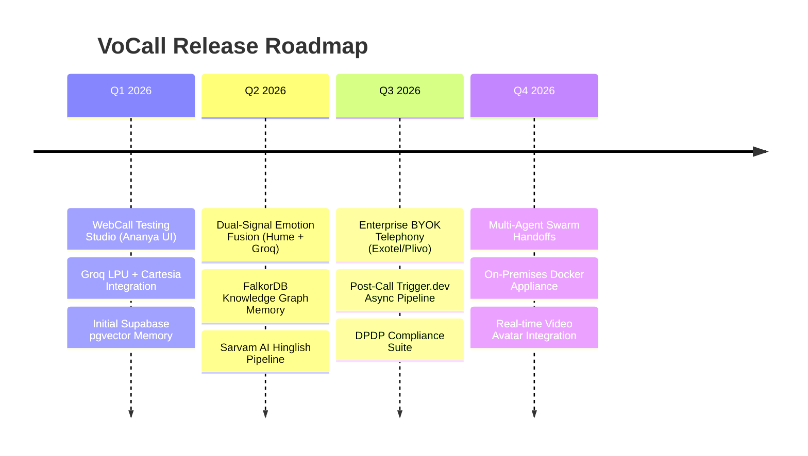

# VoCall — Product Requirements Document (PRD)

**Document Version:** 2.0  
**Status:** Approved / Specification Baseline  
**Date:** July 2026  
**Author:** Product & AI Architecture Team  
**Target Platform:** VoCall Voice AI Platform  

---

## 1. Executive Summary & Vision

**VoCall** is an enterprise-grade, open-source voice AI orchestration platform designed to build, test, and deploy empathetic, real-time voice agents. Unlike conventional voice bots that rely on static scripts and flat context, VoCall features a **Dual-Signal Multimodal Emotion Fusion Engine** (combining real-time acoustic prosody with LLM text emotion analysis) and a **4-Tier Hybrid Memory Architecture** (Short-Term Redis, Long-Term pgvector, Episodic Postgres, and FalkorDB Knowledge Graph).

VoCall delivers ultra-low latency (<500ms end-to-end voice loop) with native support for Hinglish code-switched speech understanding and generation, empowering organizations across customer support, healthcare, debt recovery, and sales qualification to conduct human-grade, emotionally responsive voice interactions at scale.

---

## 2. Problem Statement & User Personas

### 2.1 Problem Statement
1. **High Latency & Robotic Delivery:** Traditional voice agents take 1.5–3 seconds to respond, breaking conversation flow and frustrating users.
2. **Context Loss Across Calls:** Standard bots treat every call as isolated, forcing returning callers to repeat their history, context, and grievances.
3. **Emotional Blindness:** Standard voice platforms cannot detect caller frustration, tone shifts, or distress, resulting in inappropriate bot responses and escalated churn.
4. **Poor Regional/Code-Switched Speech Support:** Existing voice platforms fail when handling mixed-language inputs (such as Hinglish in India), forcing unnatural monosyllabic English interactions.
5. **Rigid Developer Workflows:** Testing voice agents requires physical phone numbers or expensive SIP setups, slowing down development cycles.

### 2.2 Target Personas

| Persona | Role | Key Pain Points | Desired VoCall Solution |
|---|---|---|---|
| **AI Product Manager** | Defines agent behavior, conversational scripts, and tone | Difficulty auditing bot empathy and evaluating post-call outcomes | Agent Studio with prompt enhancers, emotion arc charts, and granular post-call analytics |
| **Full-Stack / Voice Engineer** | Integrates telephony, CRMs, and custom backend tools | Complex WebRTC/SIP setup, high latency, fragmenting memory databases | Unified FastAPI backend, LiveKit WebCall modal, 4-tier memory API, Trigger.dev async pipelines |
| **Customer Success / Call Center Director** | Oversees customer retention, resolution rates, and compliance | High churn from frustrated callers, lack of TRAI/DPDP compliance tools | Dual-signal emotion escalation, graph memory tracing caller grievances, DPDP "Forget Me" cascade deletion |
| **Sales & Business Development Lead** | Manages inbound lead qualification and outreach | Low conversion rates due to delays and non-personalized voice outreach | Sub-second voice synthesis (Cartesia), native Hinglish (Sarvam AI), during-call CRM connectors |

---

## 3. Core Product Value Proposition & Research Innovations

```
┌───────────────────────────────────────────────────────────────────────────────────────────┐
│                                 VOCALL PRODUCT CORE PILLARS                               │
└─────────────────────────────┬─────────────────────────────────────────────────────────────┘
                                              │
         ┌────────────────────────────────────┼────────────────────────────────────┐
         │                                    │                                    │
┌────────▼──────────┐              ┌──────────▼──────────┐              ┌──────────▼──────────┐
│ Dual-Signal       │              │ 4-Tier Memory       │              │ Multilingual        │
│ Emotion Fusion    │              │ RAG Engine          │              │ Voice Pipeline      │
├───────────────────┤              ├─────────────────────┤              ├─────────────────────┤
│ Audio Prosody     │              │ Tier 1: Upstash     │              │ Groq Whisper (EN)   │
│ (Hume AI EVI) +   │              │ Tier 2: pgvector    │              │ Sarvam Saarika (HI) │
│ Text NLP          │              │ Tier 3: Episodic    │              │ Cartesia Sonic-2    │
│ (Groq LLaMA 3.3)  │              │ Tier 4: FalkorDB    │              │ Sarvam Bulbul       │
└───────────────────┘              └─────────────────────┘              └─────────────────────┘
```

1. **Dual-Signal Emotion Fusion Engine:** Fuses real-time acoustic tone (Hume AI EVI) and text sentiment (Groq LLaMA 3.3 70B) into a unified valence/arousal score. Triggers dynamic system prompt shifts and adjusts TTS voice parameters on the fly.
2. **4-Tier Memory Architecture:** Blends ephemeral call memory (Upstash Redis), semantic facts (Supabase pgvector), post-call episode summaries (Postgres), and entity relationship causal graphs (FalkorDB).
3. **Sub-500ms Voice Loop:** Achieved via Pipecat pipeline orchestration, Groq LPU inference (~150ms), and Cartesia Sonic-2 TTS (~80ms).
4. **Hinglish Native Pipeline:** Deep integration with Sarvam AI (Saarika STT & Bulbul TTS) for flawless Indian code-switching handling.
5. **Interactive WebCall Studio ("Ananya UI"):** In-browser WebRTC voice agent testing modal complete with live transcript stream, visual orb states, and post-call save/discard workflow.

---

## 4. Product Modules & Functional Specifications

### 4.1 Agent Studio & Configuration Console

- **Prompt-First Agent Creation:** Free-text textarea for system instructions with real-time prompt enhancement (`POST /api/agents/{id}/enhance-prompt`).
- **Use Case Templates:** One-click pre-built configurations for Customer Support, Sales Qualification, Appointment Booking, Debt Recovery, HR Screenings, and Healthcare Triage.
- **UI / Code View Split:** Seamless toggle between visual configuration forms and syntax-highlighted JSON schema editor.
- **Domain Import Scraper:** Paste domain URL to extract business metadata, service offerings, and tone guidelines directly into agent prompts.

### 4.2 Voice Catalog & Provider Routing

- **Provider Support:** Cartesia (English sub-80ms), Sarvam AI (Hindi/Hinglish sub-150ms), Hume AI Octave 2 (Emotion-conditioned voice generation).
- **Voice Selection UI:** Filterable voice cards with gender badges, language tags (EN, HI, Hinglish, MR), provider latency indicators, and live audio previews.
- **Dynamic Routing Engine:** Auto-selects STT/TTS models based on active agent language configuration and caller emotion status.

### 4.3 Web Call Testing Studio (Ananya UI / `WebCallModal`)

- **Pre-Call Identification:** Contact name input field to link live browser call sessions with Supabase `contacts` table for 4-tier memory retrieval.
- **Interactive Lifecycle States:**
  - `idle`: Permission check & contact input.
  - `connecting`: Animated pulse orb (`bg-[#7C3AED]/30`) with status indicator.
  - `active`: Split-view UI featuring dynamic voice orb (agent speaking = purple ping pulse; user speaking = emerald pulse), live auto-scrolling transcript stream, live call timer, and mute/end-call controls.
  - `ended`: Post-call decision screen displaying session duration, transcript preview, and direct option to "Save & View Analysis" or "Discard Test Record".

### 4.4 Telephony & BYOK Infrastructure

- **Twilio Integration:** Webhook and WebSocket stream handler for inbound/outbound PSTN calling.
- **BYOK Indian Telephony:** Integrations with Exotel and Plivo for low-cost, TRAI-compliant Indian calling with TRAI DLT registration and KYC verification workflow.
- **Calling Hours & Schedules:** Configurable day-of-week and time-window restrictions for automated outbound dialing campaigns.

### 4.5 4-Tier Memory & Graph RAG Engine

- **Tier 1 (Short-Term):** Upstash Redis buffer (`stm:{call_id}`) storing live turn transcripts, active emotion state, and mid-call connector outputs.
- **Tier 2 (Long-Term Semantic):** Supabase `pgvector` storing 1536-dimensional embeddings of contact facts, preferences, and key attributes, queried via cosine similarity.
- **Tier 3 (Episodic):** Supabase Postgres storing chronological post-call summaries (last 3 episodes auto-injected at call start).
- **Tier 4 (Knowledge Graph):** FalkorDB storing entity nodes (Contact, Topic, Episode, Emotion) and edges (`MENTIONED`, `FRUSTRATED_ABOUT`, `LEADS_TO`) queried via Cypher.
- **DPDP "Forget Me" Compliance:** Endpoint `DELETE /api/contacts/{id}/memory` performing cascading memory wipe across all 4 storage engines to comply with India's Digital Personal Data Protection Act 2023.

### 4.6 Dual-Signal Emotion Engine

- **Real-time Acoustic Signal:** Continuous prosody and pitch analysis via Hume AI Expression Measurement API.
- **Real-time Text Signal:** Turn-by-turn sentiment evaluation using Groq LLaMA 3.3 70B JSON mode.
- **Fusion Logic:** Fused score formula ($Valence_{fused} = 0.6 \times Valence_{audio} + 0.4 \times Valence_{text}$).
- **Action Triggers:**
  - Inject empathetic tone instruction into system prompt when valence drops below -0.4.
  - Modulate Hume Octave TTS voice pitch and tempo based on emotional valence/arousal.
  - Auto-fire webhook or human handoff connector when frustration score exceeds configured threshold (>0.7).

### 4.7 Multi-Connector Workflows

- **During-Call Tools:** Mid-call LLM function calling for Google Calendar scheduling, HubSpot CRM lead capture, Supabase database queries, and custom REST webhooks.
- **Post-Call Async Pipeline:** Trigger.dev background worker executing transcript evaluation, summary generation, pgvector fact embedding, FalkorDB graph updating, WhatsApp dispatch, and Resend email alerts.

---

## 5. Non-Functional Requirements (NFRs)

### 5.1 Performance & Latency Budgets
- **Speech-to-Text (STT):** ≤ 150ms (Groq Whisper) / ≤ 200ms (Sarvam Saarika).
- **LLM First-Token Generation:** ≤ 150ms (Groq LLaMA 3.3 70B).
- **Text-to-Speech (TTS):** ≤ 80ms TTFAB (Cartesia Sonic-2).
- **End-to-End Voice Loop:** ≤ 450ms total response latency.
- **Memory RAG Retrieval:** Parallel 4-tier fanout ≤ 100ms.

### 5.2 Scalability & Availability
- **Backend API:** Stateless FastAPI instance deployable on Railway/Docker, horizontal auto-scaling based on CPU/RAM.
- **Media Pipeline:** LiveKit Cloud distributed WebRTC server infrastructure with dynamic room allocation.
- **Database:** Supabase Postgres auto-scaling with `pgvector` indexing (`ivfflat` / `hnsw`).
- **Redis:** Upstash serverless auto-scaling throughput.

### 5.3 Security & Compliance
- **Encryption at Rest:** All BYOK API keys encrypted using AES-256 in Supabase.
- **Encryption in Transit:** TLS 1.3 for REST/WebSockets; WebRTC SRTP for voice media.
- **Access Control:** Supabase Row-Level Security (RLS) enforcing tenant isolation across organizations.
- **Data Protection Compliance:** India DPDP Act 2023 compliant single-click data erasure across Redis, pgvector, Postgres, and FalkorDB graph.

---

## 6. Success Metrics & Key Performance Indicators (KPIs)

| Metric Category | Indicator | Target KPI |
|---|---|---|
| **Latency** | End-to-End Voice Turn Latency | < 500 ms |
| **Voice Quality** | First-Byte Audio Latency (TTFAB) | < 100 ms |
| **Emotion Engine** | Acoustic & Text Emotion Fusion Accuracy | > 90% correlation with human raters |
| **Memory Precision** | Relevant Context Retrieval Precision (RAG) | > 92% relevant fact injection |
| **Task Completion** | Automated Call Task Completion Rate | > 85% without human escalation |
| **User Experience** | Post-Call CSAT Improvement | +35% improvement vs legacy IVR |

---

## 7. Product Roadmap & Release Schedule



---
*Approved by VoCall Engineering & Product Team*
